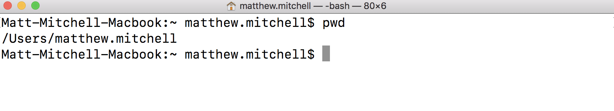
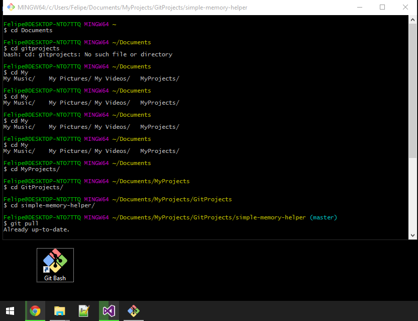

# The Bash Shell

## Introduction 
When conducting data science (or programming in general), it’s helpful to get oriented with the command line, or bash shell. On mac computers, this is the terminal application. You've actually already seen some of this when working through how to download lessons from Learn and Github onto your local computer! The command line serves as a low-level interpreter through which you, the user, can send commands directly to the computer. As a computer user, you previously have probably sent commands to the computer through a graphical user interface (GUI) such as a web browser, text editor, photo editor, or any other of the myriad of computer programs now in existence. While the command line is initially daunting with its cryptic looking text, we will quickly see some of the many advantages it can have.

## Objectives
You will be able to:
* Open up a bash shell
* Check the current working directory with pwd
* List files in the current directory using ls
* Make directories using mkdir

## Shells
To start, open up your shell program. For mac, this is the terminal, and for Windows we recommend git bash. Note that the "command prompt" on Windows make look similar but is actually another language.

## Mac

## Windows

## Workflow Hints

When going back and forth between this lesson and your shell, it is useful to either use split screen or to know the shortcuts to switch between applications on your computer. 

Shortcuts to change programs/applications:
* Mac: (cmd+tab)
* Windows: (alt+tab)

## pwd
Remember, **pwd** which stands for **print working directory**. This is essential to determine where you are within the file structure.  

## cd

From there, remember that **cd** stands for **change directory**. You can navigate to the home directory with `cd` alone, or go up one level with `cd ..`. You can also use the `~` symbol to refer to your home directory. For example, `cd ~/Documents` will take you to the Documents folder in your home directory no matter where you are. 

## Tab completion
Another useful feature when working on the command line is tab completion. This also works in many other programming environments such as Jupyter notebooks.

## Additional Resources

* [More Basic Shell Commands](http://www.ks.uiuc.edu/Training/Tutorials/Reference/unixprimer.html)
* [Linux Bash Man Page](https://linux.die.net/man/1/bash)
* [Detailed Bash](https://tiswww.case.edu/php/chet/bash/bashref.html)

## Summary

In this lesson, we reviewed some of the basic bash commands in order to navigate through files and folders on your computer. From here, we're ready to get started with git, an important version control system used by many programmers, developers and data scientists.

